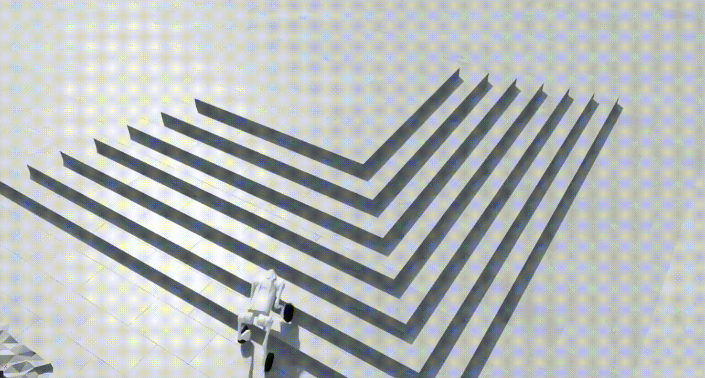
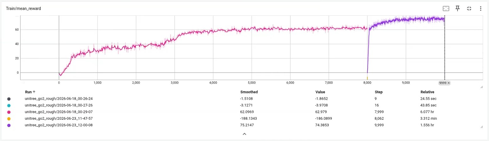
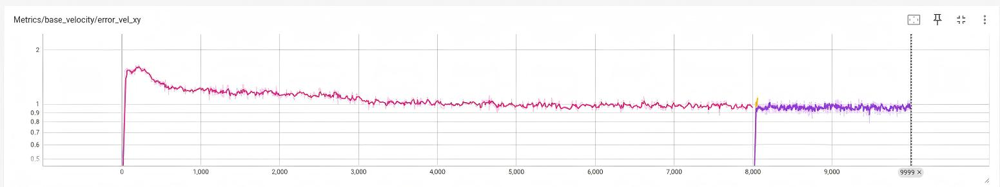
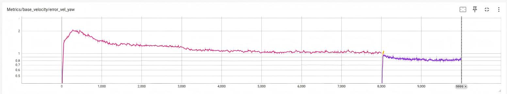
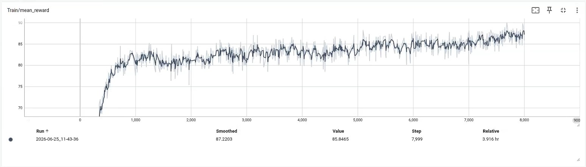
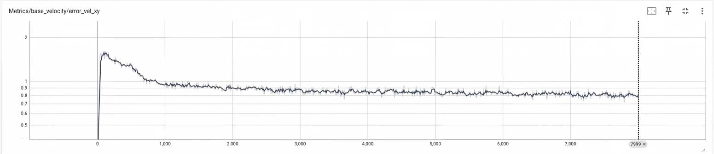
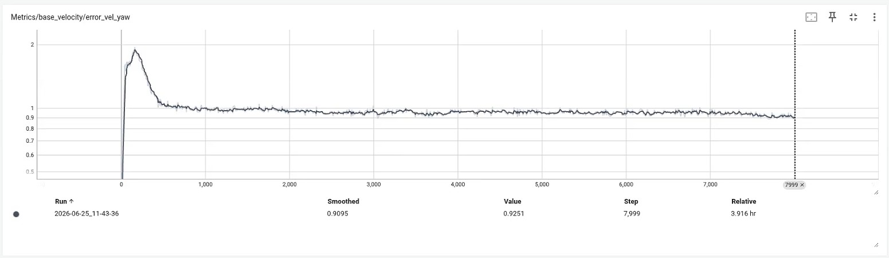

# Go2 RL Suite (Unitree Go2 / Go2W)

This project implements PPO-based locomotion policies for Unitree Go2 and Go2W using Isaac Lab + RSL-RL, and evaluates their behavior under identical training environments with different robot morphologies and terrain scenarios.

---

## Overview

trained and evaluated locomotion policies for two quadruped robot variants:

- **Go2 (standard quadruped)**
- **Go2W (wheeled / modified morphology)**

Both models are trained under the same terrain distribution and RL configuration, and evaluated across multiple terrain types:

- Rough terrain  
- Sloped terrain  
- Stair-like / discontinuous terrain  

---

## Key Contributions

- PPO-based locomotion training (RSL-RL + Isaac Lab)  
- Stable policy convergence (~8k–10k iterations)  
- Cross-terrain evaluation under identical training setup  
- Morphology comparison (Go2 vs Go2W)  
- Real-time keyboard-based control in simulation  

---

## Technical Stack

- Isaac Lab (NVIDIA)
- RSL-RL (PPO)
- Isaac Sim 5.1.0
- PyTorch 2.7.0+
- GPU-parallel simulation
- Linux (Ubuntu 22.04)
- Python 3.11

---

## Repository Structure

```text
go2_rl_suite/
├── models/        # trained checkpoints (.pt)
├── media/         # videos and GIF demos
├── results/       # training curves and evaluation plots
├── scripts/       # training and inference
└── configs/       # optional configs
```

---

## Results

### Go2 (Rough Terrain)

- Stable locomotion on uneven terrain  
- Reduced lateral drift  
- Converged reward ≈ 60+  

---

### Go2W (Stairs / Complex Terrain)

- Robust climbing behavior  
- Stable traversal on discontinuous surfaces  
- Higher final reward (~70+)  

---

## Visual Results

### Go2

<p align="center">
  
</p>

- `media/go2/Go2_control.mp4`  
- `media/go2/Go2_control_stage.mp4`
- `media/go2/Go2.mp4`

---

### Go2W

<p align="center">
  
</p>

- `media/go2w/Go2W_rough.mp4`  
- `media/go2w/Go2W_stage.mp4`  

---

## Training Curves

### Go2





---

### Go2W





---

Tracked metrics:

- Mean reward  
- Velocity tracking error  
- Terrain curriculum progression  

Stored in:

- `results/go2/`  
- `results/go2w/`  

Includes:

- Reward curves  
- Base velocity error (xy / yaw)  
- Curriculum level progression  

---

## Usage

### Training

```bash
python scripts/train.py \
  --task RobotLab-Isaac-Velocity-Rough-Unitree-Go2-v0 \
  --headless
```

---

### Evaluation

```bash
python scripts/play.py \
  --task RobotLab-Isaac-Velocity-Rough-Unitree-Go2-v0 \
  --checkpoint models/go2/model_9999.pt
```

---

### Keyboard Control (Isaac Viewer)

- Move: Arrow keys / Numpad  
- Rotate: Z / X  
- Enable keyboard control via play script option  

---

## Notes

- Both policies use the same RL pipeline from https://github.com/fan-ziqi/robot_lab  
- Training configuration is identical for Go2 and Go2W  
- Differences come purely from robot morphology and evaluation dynamics  

---

## Models

| Robot | Checkpoint |
|------|------------|
| Go2 | `models/go2/model_9999.pt` |
| Go2W | `models/go2w/model_7999.pt` |

---

## Future Work

- Sim2Real transfer on Unitree hardware  
- Improved domain randomization  
- Unified morphology-conditioned policy learning  
- Real-world deployment  

---

## Author

Chunmiao Li

University of California, Berkeley
